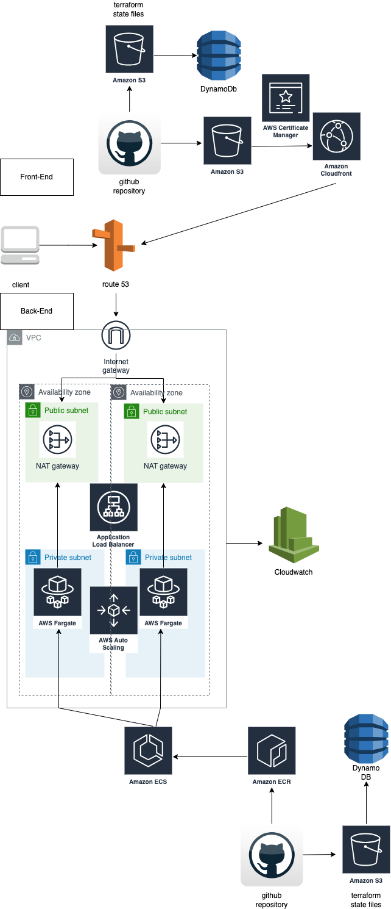

# JOB-POST

## Architecture Overview

The architecture is composed of a front-end and back-end system, designed for high availability and scalability within a cloud environment.



### Front-End

The front-end is hosted using AWS services, ensuring scalability and global distribution:

- **Amazon CloudFront**: A fast content delivery network (CDN) service that securely delivers data, videos, applications, and APIs to customers globally with low latency and high transfer speeds.
- **AWS Certificate Manager**: Handles the SSL certificate for securing network communication and establishing the identity of websites over the internet.

### Infrastructure Management

The infrastructure is managed as code using Terraform, providing a consistent and reproducible environment:

- **GitHub Repository**: Stores the Terraform configuration files for defining the required resources on AWS.
- **Amazon S3**: Hosts the Terraform state files, ensuring the state is shared and locked when multiple people work with Terraform.
- **DynamoDB**: Acts as a locking mechanism to prevent concurrent operations on the same Terraform state.


This is a [Next.js](https://nextjs.org/) project bootstrapped with [`create-next-app`](https://github.com/vercel/next.js/tree/canary/packages/create-next-app).

## Getting Started

First, run the development server:

```bash
npm run dev
# or
yarn dev
# or
pnpm dev
```

Open [http://localhost:3000](http://localhost:3000) with your browser to see the result.

You can start editing the page by modifying `app/page.js`. The page auto-updates as you edit the file.

This project uses [`next/font`](https://nextjs.org/docs/basic-features/font-optimization) to automatically optimize and load Inter, a custom Google Font.

## Learn More

To learn more about Next.js, take a look at the following resources:

- [Next.js Documentation](https://nextjs.org/docs) - learn about Next.js features and API.
- [Learn Next.js](https://nextjs.org/learn) - an interactive Next.js tutorial.

You can check out [the Next.js GitHub repository](https://github.com/vercel/next.js/) - your feedback and contributions are welcome!
